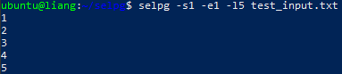
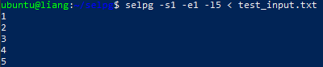
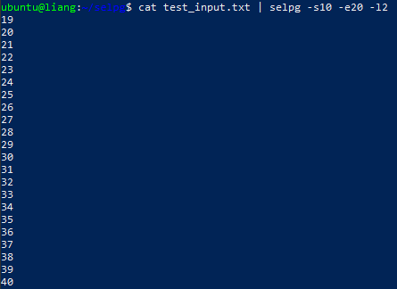
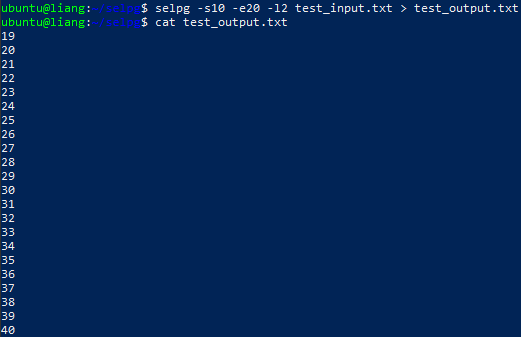
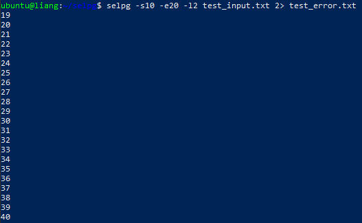
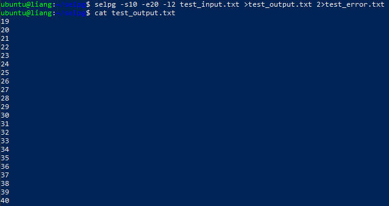
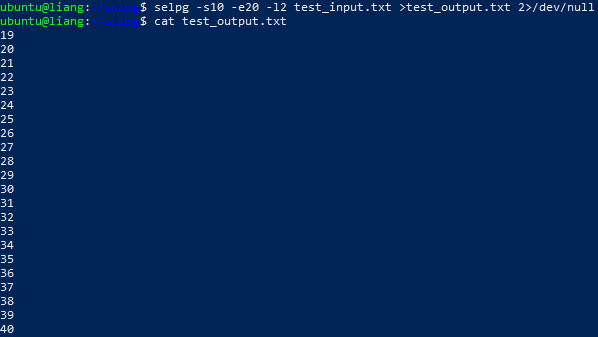
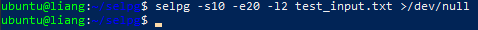
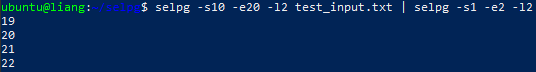
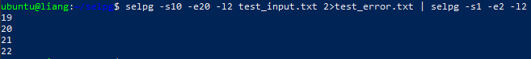

# 使用 golang 开发 selpg

## 实验环境

- ubuntu18.04
- go1.13

## 项目依赖

- [pflag](https://github.com/spf13/pflag)

## 实验过程

### 初始化项目

```bash
go mod init github.com/liangwj45/selpg
```

### 安装依赖

```bash
go get github.com/spf13/pflag
```

### 创建并编写 main.go 文件

#### 设置全局变量

```go
var (
	startPage = flag.IntP("start-page", "s", -1, "start page")
	endPage = flag.IntP("end-page", "e", -1, "end page")
	pageLen = flag.IntP("page-len", "l", 72, "number of lines in a page")
	pageBreak = flag.BoolP("use-page-break", "f", false, "pages devided by page break")
	printDest = flag.StringP("print-dest", "d", "", "printing destination")
	pageType string
)
```

#### 编写解析参数相关函数

```go
func parseArgs() error {
  flag.Parse()  // 使用pflag提供的方法解析命令行参数

  if *pageBreak {  // 判断文件分页格式
    pageType = "f"
  } else {
    pageType = "l"
  }

  if *startPage == -1 || *endPage == -1 {  // 判断参数是否完整（起始页和结束页）
    printUsage()
    return errors.New("arguments are not enough")
  }

  if *startPage <= 0 || *endPage <= 0 {  // 判断页码是否合理
    return errors.New("page number can not be negative")
  }

  if *startPage > *endPage {  // 判断页码是否合理
    return errors.New("start page cannot be greater than end page")
  }

  if pageType == "l" && *pageLen <= 0 {  // 判断页长是否合理
    return errors.New("line number can not be negative")
  }

  if pageType == "f" && *pageLen != 72 {  // 判断是否同时设置两种分页格式
    return errors.New("-f and -lNumber cannot be set at the same time")
  }

  return nil
}
```

#### 编写读取文件并打印操作相关函数

```go
func readAndPrint() error {
  var reader *bufio.Reader  // 定义一个输入流
  var writer *bufio.Writer  // 定义一个输出流

  if flag.NArg() == 0 {  // 根据[FILE]参数给输入流赋值
    reader = bufio.NewReader(os.Stdin)
  } else {
    input, err := os.Open(flag.Arg(0))
    if (err != nil) {
      return err
    }
    defer input.Close()
    reader = bufio.NewReader(input)
  }
  
  if len(*printDest) == 0 {  // 根据-d参数给输出流赋值
    writer = bufio.NewWriter(os.Stdout)
  } else {
    cmd := exec.Command("lp", "-d"+*printDest)
    output, err := cmd.StdinPipe()
    if err != nil {
      return err
    }
    defer output.Close()
    cmd.Stdout = os.Stdout
    if err := cmd.Start(); err != nil {
      return err
    }
    writer = bufio.NewWriter(output)
  }
  defer writer.Flush()

  var pageSpliter byte  // 获取分页格式标识符
  if pageType == "f" {
    pageSpliter = '\f'
  } else {
    pageSpliter = '\n'
  }

  pages, lines := 1, 0
  for {
    sub, err := reader.ReadBytes(pageSpliter)  // 根据标识符读取一段内容
    if err == io.EOF {
      break
    } else if err != nil {
      return err
    }
    if pageType == "f" {  // 进行行/页相应处理
      pages++
    } else {
      lines++
      if lines > *pageLen {
        lines = 1
        pages++
      }
    }
    if pages >= *startPage && pages <= *endPage {
      if _, err := writer.Write(sub); err != nil {
        return err
      }
    } else {
      break
    }
  }

  return nil
}
```

#### 编写主函数及异常处理函数

```go
func main() {
  handleError(parseArgs())
  handleError(readAndPrint())
}


func printUsage() {  // 打印使用方法
  fmt.Fprintln(os.Stderr, "Usage: selpg -sNumber -eNumber [-lNumber/-f] [-dDestination] [filename]")
  flag.PrintDefaults()
  os.Exit(2)
}

func handleError(err error) {  // 错误处理
  if err != nil {
    if _, err2 := fmt.Fprintf(os.Stderr, "%s\n", err.Error()); err2 != nil {
      panic(err2)
    }
    os.Exit(1)
  }
}
```

### 编译执行

```bash
go build && go install
selpg
```

### 效果测试

使用 `test_input_generator.sh` 生成1 至 3600 的自然数，并将其写入到 `test_input.txt` 。

根据文档 [开发 Linux 命令行实用程序](https://www.ibm.com/developerworks/cn/linux/shell/clutil/index.html) 中 **使用 selpg** 章节的要求，测试如下：

#### 1 $ selpg -s1 -e1 input_file

该命令将把“input_file”的第 1 页写至标准输出。



#### 2 $ selpg -s1 -e1 < input_file

该命令与示例 1 所做的工作相同，但在本例中，selpg 读取标准输入，而标准输入已被 shell／内核重定向为来自“input_file”而不是显式命名的文件名参数。输入的第 1 页被写至屏幕。



#### 3 $ other_command | selpg -s10 -e20

“other_command”的标准输出被 shell／内核重定向至 selpg 的标准输入。将第 10 页到第 20 页写至 selpg 的标准输出（屏幕）。



#### 4 $ selpg -s10 -e20 input_file >output_file

selpg 将第 10 页到第 20 页写至标准输出；标准输出被 shell／内核重定向至“output_file”。



#### 5 $ selpg -s10 -e20 input_file 2>error_file

selpg 将第 10 页到第 20 页写至标准输出（屏幕）；所有的错误消息被 shell／内核重定向至“error_file”。请注意：在“2”和“>”之间不能有空格；这是 shell 语法的一部分（请参阅“man bash”或“man sh”）。



#### 6 $ selpg -s10 -e20 input_file >output_file 2>error_file

selpg 将第 10 页到第 20 页写至标准输出，标准输出被重定向至“output_file”；selpg 写至标准错误的所有内容都被重定向至“error_file”。当“input_file”很大时可使用这种调用；您不会想坐在那里等着 selpg 完成工作，并且您希望对输出和错误都进行保存。



#### 7 $ selpg -s10 -e20 input_file >output_file 2>/dev/null

selpg 将第 10 页到第 20 页写至标准输出，标准输出被重定向至“output_file”；selpg 写至标准错误的所有内容都被重定向至 /dev/null（空设备），这意味着错误消息被丢弃了。设备文件 /dev/null 废弃所有写至它的输出，当从该设备文件读取时，会立即返回 EOF。



#### 8 $ selpg -s10 -e20 input_file >/dev/null

selpg 将第 10 页到第 20 页写至标准输出，标准输出被丢弃；错误消息在屏幕出现。这可作为测试 selpg 的用途，此时您也许只想（对一些测试情况）检查错误消息，而不想看到正常输出。



#### 9 $ selpg -s10 -e20 input_file | other_command

selpg 的标准输出透明地被 shell／内核重定向，成为“other_command”的标准输入，第 10 页到第 20 页被写至该标准输入。“other_command”的示例可以是 lp，它使输出在系统缺省打印机上打印。“other_command”的示例也可以 wc，它会显示选定范围的页中包含的行数、字数和字符数。“other_command”可以是任何其它能从其标准输入读取的命令。错误消息仍在屏幕显示。



#### 10 $ selpg -s10 -e20 input_file 2>error_file | other_command

与上面的示例 9 相似，只有一点不同：错误消息被写至“error_file”。



